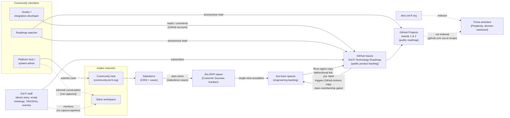

# Community Input and Product Management Workflow

> **Owner**: Stephen Fuqua \
> **Last updated**: 2026-09-03 \
> **Purpose:** This document describes the current workflow as designed and operated, as of
> 2026-09-03. It is a factual record of observed behavior — systems, roles, and information
> flow — with no statement of requirements, problems, or proposed changes.

## 1. Actors

- **Community member — roadmap watcher.** Views the public roadmap without an account.
- **Community member — platform host / system administrator.** Files defect reports, typically
  through the Community Hub or Slack; usually holds a Salesforce Community account and often a
  Slack account; rarely holds a GitHub account.
- **Community member — vendor / integration developer.** The most technically inclined persona;
  most likely to already hold a GitHub account; participates through GitHub Issues.
- **Ed-Fi Customer Success.** A Technical Program Manager plus contract engineers and analysts who
  work the Jira `EDFI` space as a daily Kanban board.
- **Ed-Fi Product Manager, program managers, and team leads.** Curate the public product backlog
  (GitHub Issues) and the public roadmap (GitHub Projects).
- **Ed-Fi development contractors.** Work Jira sprints and Kanban boards in team spaces; do not
  work in the product backlog.
- **MSDF IT.** Owns and administers Salesforce and Jira Cloud as enterprise services, and the Entra
  directory that fronts staff identity.

## 2. Systems inventory

| System | Owner | Role today | Community access |
| --- | --- | --- | --- |
| Salesforce (CRM) | MSDF IT | Organization and contact records, Chatter | Members hold accounts |
| Community Hub (`community.ed-fi.org`) | Ed-Fi Community team, on Salesforce | Case submission, deflection, member content | Authenticated members |
| Jira Cloud — `EDFI` space | Ed-Fi staff, MSDF IT admin | Customer Success daily Kanban | None |
| Jira Cloud — team spaces | Ed-Fi staff, MSDF IT admin | Engineering backlog, four teams | None; Data Standard space is public read-only |
| GitHub Issues — `Ed-Fi-Technology-Roadmap` | Ed-Fi technical staff | Public product backlog, releases | Read and comment anonymously/with GitHub account; cannot create |
| GitHub Projects (boards 1 and 2) | Ed-Fi technical staff | Public roadmap views by product and by quarter | Anonymous read |
| Slack | Ed-Fi technical staff | Informal community conversation | Separate accounts, unlinked to Salesforce |
| `docs.ed-fi.org` | Ed-Fi | Technical documentation; the bulk of public search traffic | Anonymous |
| Fiona (Perplexity-based assistant) | Ed-Fi | Answers member questions; sources restricted by domain | Public |

## 3. Workflow as designed

### 3.1 Intake

Community input enters through one of several unconnected channels:

- **Community Hub** (`community.ed-fi.org`, built on Salesforce) — authenticated members submit
  support cases.
- **Slack** — informal conversation in the community workspace. Slack identities are separate from
  Salesforce identities.
- **Direct staff entry** — staff record input on a member's behalf from email, meetings,
  governance forums (TAG, SIGs), and events.
- **GitHub Issues** — staff create issues in the `Ed-Fi-Technology-Roadmap` repository directly.
  Issue creation is staff-only; blank issue creation is disabled, and templates route members back
  to the Community Hub.

### 3.2 Case handling (Customer Success)

1. A case submitted through the Community Hub is recorded in Salesforce.
2. Salesforce cases clone automatically into the Jira `EDFI` space. Customer Success works this
   space as their Kanban board.
3. Member-facing communication about the case continues through Salesforce, not Jira.
4. If Customer Success cannot resolve an item and it needs engineering attention, escalating an
   `EDFI` item to a development team's Jira space is a single Jira clone action.

### 3.3 Promotion to the public product backlog

1. A custom Atlassian Rovo agent copies a Jira work item out to the `Ed-Fi-Technology-Roadmap`
   GitHub repository as a GitHub Issue, writing bidirectional links in both the Jira item and the
   GitHub Issue.
2. Separately, a GitHub Actions workflow watches for a `jira-<space-key>` label applied to a GitHub
   Issue. When found, it copies that Issue into the indicated Jira space and records the resulting
   Jira link in a custom field on the Issue. This workflow checks the actor's GitHub team
   membership before acting, so only authorized staff can trigger promotion in this direction.

### 3.4 Public visibility

1. GitHub Issues in `Ed-Fi-Technology-Roadmap` constitute the public product backlog. Anyone can
   read and comment; commenting requires a GitHub account. Anonymous visitors can read without an
   account.
2. GitHub Projects boards 1 and 2 present the public roadmap, organized by product and by quarter,
   viewable anonymously with no sign-in.

### 3.5 Assistant and documentation

1. `docs.ed-fi.org` hosts public technical documentation and carries the bulk of public search
   traffic.
2. Fiona, the Ed-Fi AI assistant (built on Perplexity), answers member questions from an index
    restricted to sources under specific domains: `www.ed-fi.org` and `docs.ed-fi.org`.
    `github.com` is not among its indexed sources.

### 3.6 Slack capture

A Slack-to-GitHub-Issue integration has been built but is not deployed. A Slack-to-Salesforce
connection exists as a concept but has not been keyed or approved.

## 4. Information flow diagram

## 5. Glossary

- **Community Hub** — `community.ed-fi.org`, the Salesforce-hosted member site providing case
  submission, deflection, and member content.
- **Customer Success team** — the Technical Program Manager plus contract engineers and analysts
  who work the support caseload.
- **`EDFI` space** — the Jira project used by Customer Success as their daily Kanban board; the
  landing point for cases cloned from Salesforce.
- **Engineering backlog** — fine-grained execution work in Jira team spaces: tasks, subtasks,
  technical debt, spikes.
- **Fiona** — the Ed-Fi AI assistant, built on Perplexity, whose sources are restricted by domain.
- **Product backlog** — the curated, community-facing set of ideas and defects, currently GitHub
  Issues.
- **Rovo agent** — the custom Atlassian agent that copies a Jira work item out to GitHub.

## 6. Related Documentation

- [Dual Backlog: GitHub Issues + Jira — Options](./dual-backlog-options.md), March 2026, superseded by:
- [PRD: Community Input and Product Management System](./prd-community-input-and-product-management.md), September 2026
